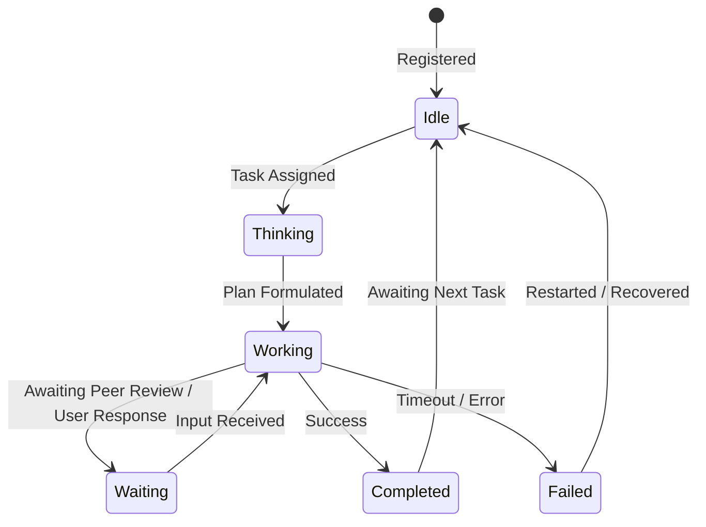

# AI Agent Lifecycle Specification

This document details the state transitions, capabilities, and execution metrics of the Vecna AI agent framework.

---

## 1. Agent States and Lifecycle

Each agent registered in the Swarm Registry transitions dynamically through the following states:



* **`Idle`**: The agent has completed all active queue items and is listening to the task allocation pipeline.
* **`Thinking`**: The agent is formulating an implementation plan, querying semantic memory, or evaluating consensus parameters.
* **`Working`**: Active processing of assignments. High CPU/Memory utilization.
* **`Waiting`**: Suspended state. Occurs when waiting for code reviews, database locks, or user interaction tokens.
* **`Completed`**: Task finalized, results uploaded to repository, and cache flushed.
* **`Failed`**: Task halted due to validation or dependency issues. Re-entered into task retry loops.

---

## 2. Agent Registry Schema

```typescript
interface Agent {
  id: string;
  name: string;
  designation: string;
  status: "IDLE" | "THINKING" | "WORKING" | "WAITING" | "COMPLETED" | "FAILED";
  cpuUsage: number;
  memoryUsage: number;
  reliabilityRating: number;
  capabilities: string[];
  priority: "LOW" | "MEDIUM" | "HIGH" | "CRITICAL";
  resourceLimits: {
    maxCpu: number;
    maxMemory: number;
  };
}
```
