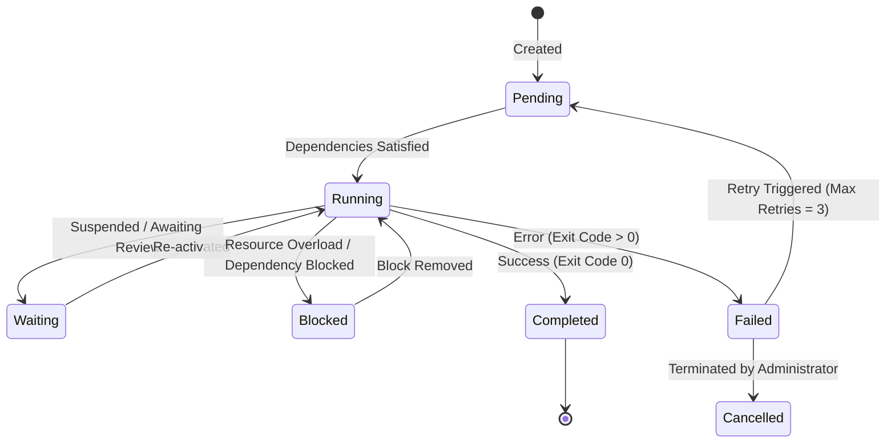

# Assignment Engine Specification

This document details the scheduling, dependency validation, and state machine transitions of the task execution engine.

---

## 1. Assignment Lifecycle State Machine

---

## 2. Priority and Deadlines

Assignments have four priority tiers:
1. **`CRITICAL`**: Bypasses the scheduler queue, allocated directly to free CPU slots.
2. **`HIGH`**: Prioritized queue allocation.
3. **`MEDIUM`**: Standard scheduling.
4. **`LOW`**: Idle queue background execution.

---

## 3. Dependency Graph Resolution

Before transitioning an assignment from `PENDING` to `RUNNING`, the **Background Scheduler** traverses the task dependency array:
* Cycle detection checks for circular reference exceptions (e.g. A depends on B, B depends on A).
* Ensures all listed prerequisite assignment IDs have status = `COMPLETED`.
